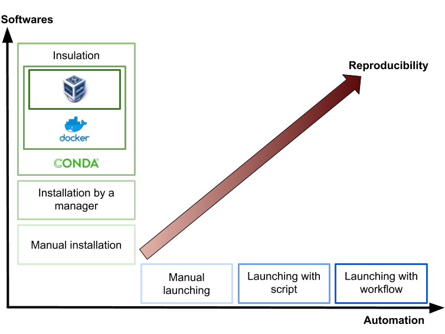

# Conclusions, perspectives and limitations

Through the FAIR\_Bioinfo training, we offer you a solution to make bioinformatic analyses reproducible. All the tools offered can be changed by other solutions. The objective was also to open up a reflection on reproducibility in Bioinformatics.

## And now ?

In this part, we will discuss the continuation and possible improvements :

* Even further in reproducibility
* Limitations of our solution

### Further in reproducibility

Reproducibility can be seen as a two-dimensional problem. It is necessary to manage the software and protocol automation.



#### **What can we do to go further?** 

We offer you 3 ways to improve your projects:

1. Install the tools in a Conda environment 
2. Create a VM and share it
3. Continuous integration 


In the following, we will propose you resources to get started but we will not implement them as part of the FAIR\_Bioinfo project.


#### What are we doing today in the FAIR\_Bioinfo project? 

**Automation**

* Manual launch : **NO**
* Launch by script : **YES** 
* Launch by workflow : **YES**

**Software**

* Local installation : **NO**
* Manager installation : **YES**
* Installation in a conda environment : **To do**
* Installation in a container : **Yes**
* Installation in a VM : **In part**

#### The different levels of insulation 

It is possible to insulate on 3 levels : 

* **Insulation by Conda enrironment**

The objective is to be able to have separate environments and thus be able to install specific tools with specific versions. Ability to export the environment.

* **Insulation by container \(docker\)**

The objective is to ensure consistency of results \(same results\).

* **Insulation by Virtual machine \(VM\)**

The objective is to resist time. The OS that runs the docker is frozen.

### Conda environment 

#### **What is a Conda environment?**

A Conda environment is an isolated workspace that allows you to install different packages with different versions

#### **Why?** 

The objective is to isolate the working environment \(isolation of the software installation\).

#### In practice

First, create an environment 

```text
conda create -n FAIR_Bioinfo
```

After, activate this environment. You enter the environment and you can start to do your installation and work.

```text
conda activate FAIR_Bioinfo
(FAIR_Bioinfo) rstudio@cac89e623f57:~$
```

To deactivate the environment :

```text
conda deactivate
```

#### Create an environment with Dockerfile

The idea is to create our docker image and install all the tools in a conda environment. We can do this using the Dockerfile.

```text
RUN conda create -n FAIR_Bioinfo -f environment.yml
ENV PATH /opt/conda/envs/FAIR_Bioinfo/bin:$PATH
```

You will find below 3 links to go further:

* [https://medium.com/@chadlagore/conda-environments-with-docker-82cdc9d25754](https://medium.com/@chadlagore/conda-environments-with-docker-82cdc9d25754)
* [https://beenje.github.io/blog/posts/docker-and-conda/](https://beenje.github.io/blog/posts/docker-and-conda/)
* [https://fmgdata.kinja.com/using-docker-with-conda-environments-1790901398](https://fmgdata.kinja.com/using-docker-with-conda-environments-1790901398)

### Virtual Machine

Today, we use the IFB's VMs. With regard to reproducibility, 3 limits can be highlighted:

* We can't be sure we're using the same
* If it disappears, we can no longer launch in the same way
* We can't share it

One solution would be to create our own VM and share it.

Many VM solutions are available: 

* Private or public clouds \(be careful about sharing and settings\) : JETSTREAM, IFB, Google Cloud,... Be careful, to check the possibility of rotating your own image. These services offer ready-made instances. 
* Local VM \(pay attention to weight and configuration\) : vmware, VirtualBox, KVM, ...

Concerning VMs on clouds, you know how to set them up \(see sessions on IFB VMs\)

For local VMs, the best known solution is VirtualBox. It is a simple solution to set up and free of charge. On the other hand, it is a resource-intensive solution and special attention must be paid to the configuration \(allocated memory\).

The process for isolation by a VM:

**1- Install VirtualBox**

The following links give you the procedure to install VirtualBox :

*  [https://fr.wikihow.com/installer-VirtualBox](https://fr.wikihow.com/installer-VirtualBox) \(multi OS\)
*  [https://doc.ubuntu-fr.org/virtualbox](https://doc.ubuntu-fr.org/virtualbox) \(Ubuntu\)

**2- Install Ubuntu in VirtualBox**

The following video explains how to install an Ubuntu VM :



**3- Install our tool**

```text
git clone https://github.com/thomasdenecker/FAIR_Bioinfo
cd FAIR_Bioinfo
sudo docker run --rm -d -p 80:8888 --name fair_bioinfo -v ${PWD}:/home/rstudio tdenecker/fair_bioinfo bash ./FAIR_script.sh
```

**4- Share the image**

You will find here how to share a VirtualBox image. The solution is not difficult to implement but be careful with the weight of the final image \(there is a complete operating system!\).

### Continuous integration

The objective is to check each time the source code is modified that the result of the modifications does not produce

* of regression in the developed application
* no change in the results obtained

Two software programs are mainly used :

* [Travis Ci](https://travis-ci.org/)
* [Circle CI](https://circleci.com/)

Concept of tests We will talk about two types of tests:

* **Unit test** 

The objective is to test part of the code. 

Module 1

```text
sum <- function(x, y){
    return (x+y)
}

# Unit test 
sum(2,2) == 4
```

Module 2

```text
power <- function(x, y){
    return (x**y)
}

# Unit test
power(2,2) == 4
```

* **Functional test**

  The objective is to test the entire code.

```text
power(sum(2,2),2) == 16
```

**Be careful to do both!**


How to test our application FAIR\_Bioinfo? 

**1- shinyTest**

A package that allows you to test shiny applications. You can find the documentation [here](https://rstudio.github.io/shinytest/articles/shinytest.html).

**2- Test the results**

Use the same input file and compare the result with a reference output file

You can find an example of this [here](https://github.com/thomasdenecker/bPeaks-application). 

#### More tests? 

In Python, it is possible to check the respect of the writing rules \(pep8,...\) An example is available [here](https://github.com/Candihub/pixel).


#### Connect to Github

You can find documentation for 

* Circle CI : [https://circleci.com/integrations/github/](https://circleci.com/integrations/github/)
* Travis CI : [https://docs.travis-ci.com/user/tutorial/](https://docs.travis-ci.com/user/tutorial/)

An example from bPeaks-application :


Objective ? Get the Holy Grail!


**Open-ended question** : We are more reproducible on the code but are the tests reproducible?

## Limits of FAIR\_Bioinfo

### Using the cloud 

#### **Problems** 

we use an already instantiated VM

#### **Consequences**

We have the same configuration but not necessarily the same hardware and not necessarily the exact same instance \(e. g. Ubuntu update\)

#### **Solutions**

We can Create your own instance

### Bit-by-bit reproducibility 

#### Problems

We reproduce an image from a dockerfile only.

#### Consequences

We are based on an existing image and updates accordingly \(lack of version control\).

#### Solutions

We can create an image from solutions like GUIX that freezes versions of Ubuntu tools.

### Parallelization and multi-threading 

#### Problems

* We lose the calculation order
* Do we use the same equipment?

#### Consequences

The calculation time ! is a Job in 1 hour exactly the same as the same job but done in 3 hours!

Are the results the same?

#### Solutions

* Configuration?
* Perform linear analyses? The calculation time is about to explode!

### A solution? 

Finding the balance between 

* bit-by-bit reproducibility 
* usability, effort, cost and ease of use

