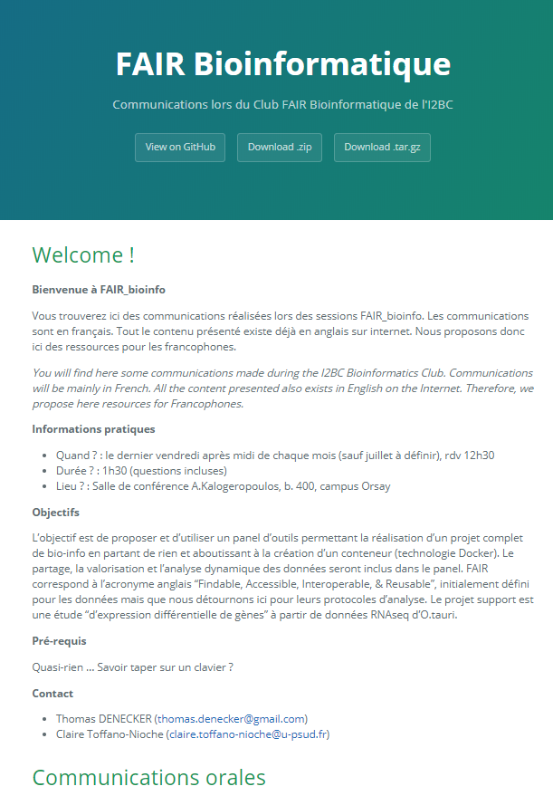

# Expose your project

In this last session,, we will explain how to  : **expose your project**

* A showcase on the web: Github pages
* Add a license
* Versioning your project: Release
* Getting a DOI: Zenodo

### A showcase on the web 

The objective is to make your project more visible. Using Github page, your project becomes easier to share and find. The advantages of GithubPage are :

* the online publishing and hosting of static site for free from our repository
* its Ability to convert Markdown to a website

The documentation is available here : [https://pages.github.com/](https://pages.github.com/)

#### In practice - From the README

In Github, go to `Settings > Options > Github pages` 


The first step is to select a source \(the master branch or the docs folder in the master branch\). Her, our README file is un master branch.


 After you select a theme. This theme will be the template applied to generate your web page.


Once these choices are made, Github converts your README into a web page and generates an address to access it.

To illustrate this transformation, here is a part of FAIR\_Bioinfo's README...

```text
# Welcome !

**Bienvenue à FAIR_bioinfo**

Vous trouverez ici des communications réalisées lors des sessions FAIR_bioinfo. Les communications sont en français. Tout le contenu présenté existe déjà en anglais sur internet. Nous proposons donc ici des ressources pour les francophones.

*You will find here some communications made during the I2BC Bioinformatics Club. Communications will be mainly in French. All the content presented also exists in English on the Internet. Therefore, we propose here resources for Francophones.*

**Informations pratiques**
- Quand ? : le dernier vendredi après midi de chaque mois (sauf juillet à définir), rdv 12h30
- Durée ? : 1h30 (questions incluses)
- Lieu ? : Salle de conférence A.Kalogeropoulos, b. 400, campus Orsay

**Objectifs**

L'objectif est de proposer et d'utiliser un panel d'outils permettant la réalisation d'un projet complet de bio-info en partant de rien et aboutissant à la création d'un conteneur (technologie Docker). Le partage, la valorisation et l'analyse dynamique des données seront inclus dans le panel.
FAIR correspond à l'acronyme anglais "Findable, Accessible, Interoperable, & Reusable", initialement défini pour les données mais que nous détournons ici pour leurs protocoles d'analyse.
Le projet support est une étude "d'expression différentielle de gènes" à partir de données RNAseq d'O.tauri.

**Pré-requis**
```

... and the result \(in real [here](https://thomasdenecker.github.io/FAIR_Bioinfo/)\)  



#### In practice - From your HTML pages 

First , It is necessary to create a docs/ folder. The home page file must be index.html. 

Then, as before, all that remains is to change the source \(master branch /docs folder\) and not to choose a theme.


You find a complete example [here](https://thomasdenecker.github.io/bPeaks-application/).

### Add a license

The purpose of a license is to determine whether users can use, modify and distribute the code/tools/software. Github allows you to add automatically filled licenses. The description of these licenses can be found [here](https://help.github.com/en/articles/licensing-a-repository).

1- Create a new file 


When you name this file LICENSE, Github offers you to use license templates


All you have to do is choose the right license for your project and Github will take care of the rest!


Once you have validated and then merged with the main branch, your license will be ready. When you click on it, you will get something like the following image :


### Create a release 

The objective is to create a version to provide a code fixed at a given time to users. All the steps are detailed [here](https://help.github.com/en/articles/creating-releases).

First, click on 0 releases  and after 'Create a new release'


To create a release you need to give a version tag and a title.


**How do version tags work?**

The semantics of the version number is divided into 3 parts separated by dots: 1.0.0. By decomposing,

* On the left: the version number **MAJOR** \(changes not backward compatible\) 
* In the middle: the **MINOR** version number \(additions/modifications of backward compatible features\)
* On the right: the version number of **FIX** \(correction of backward-compatible anomalies\)

In summary, we have therefore: MAJOR.MINOR.FIX

Finally, the first release in FAIR\_Bioinfo project :


### Obtaining a DOI

DOI or Digital Object Identifiers is a referencing system for quoting a project. This system is widely used in the world of biology \(for example for articles you can find on Pubmed\). To get this DOI, we will connect Github with Zenodo. You will find detailed documentation [here](https://guides.github.com/activities/citable-code/).

1- First, ****Go on Zenodo and log you with your Github account. 

2- Search your project in Account &gt; Github

3- Flip the switch to on


Zenodo then sends you the following message


Create a new release on Github 


Et voilà ! 

Your project has a DOI. All that remains is to add the badge to the README. Click on the badge in Zenodo then copy the code in the Markdown part. Copy this code into your README file at the top of the file.


We have the badge in the README


### And soon! 

The packages will be directly available on Github including docker! It will be possible to write detailed documentation only for package management.

To learn more, here are 2 links:

* [https://help.github.com/en/articles/about-github-package-registry](https://help.github.com/en/articles/about-github-package-registry)
* [https://github.com/features/package-registry](https://github.com/features/package-registry)


## Conclusion

In this session, we saw how to finalize a project with Github :

* Expose your project with Github Pages
* Add a license
* Make a release
* Get a DOI with Zenodo


