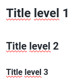

# Valuation and sharing with notebooks


Information for trainers: 

We present the Jupyter notebook \(and its association with Github and binder\) because it is a very used notebook, but due to the Rshiny part of the application, our notebook is writen in Rmarkdown. So in case of lack of time, it is possible to focus only on the "Markdown", "Rmarrkdown", and "Rmarkdown and Shiny" parts.


With the data processing workflow followed by the gene expression differential and its exploration under R, we have completed our RNAseq data analysis project. A new step for reproducibility is to associate explanations to the codes we have produced. One solution for this lies in the use of third-party software called _notebook_. We first present the language used by these software packages and then two of the most widely used ones, Jupyter or Rmarkdown . Both allow the addition of explanations associated with the codes. You just have to choose the one with which you have more affinities.

For each of the two notebooks, we also briefly present some complementary solutions that add important characteristics for reproducibility. For Jupyter, we mention binder which allows to associate a Github repository with Jupyter and thus act at each code modification. We also mention JupyterLab, a way to create Jupyter notebooks. We extend the presentation of Rmarkdown by the RShiny package that we saw in the LoveR chapter and that can also be used to generate analysis reports in a dynamic way.

## What's a notebook?

It is an interactive programming interface that allows you to combine sections in natural language and sections in computer language.


## Why a notebook ?

Notebooks are increasingly being used. But why? There are several reasons for its success. It allows to have a formatted **analysis report.** This report is **easy to export** in different formats \(HTML, PDF,...\). All analysis information are available \(code + results + graphs\). It is possible to create notebooks in a very large number of languages \(R, Python, Julia, ...\).

## Markdown

Natural language of notebook \(parts that are not code\) is written in markdown. Markdown is a [lightweight markup language](https://en.wikipedia.org/wiki/Lightweight_markup_language) with plain text formatting syntax

You already know! This is the same language used in Github's README!

You can find [here ](https://guides.github.com/features/mastering-markdown/)Github guides to help you with the markdown. You can also consult our wiki \(french\) to learn the markdown or read on for some reminders.


Markdown also has his cheat sheet \([here](https://guides.github.com/pdfs/markdown-cheatsheet-online.pdf)\).


## Quick review of basic orders

### Title

```text
# Title level 1
## Title level 2
### Title level 3
```

**Rendering**



### Italic and bold

```text
*A text in italics*
_A text also in italics_

*A text in bold*
_A text also in bold_
```

**Rendering**

_A text in italics_

_A text also in italics_

**A text in bold**

**A text also in bold**

### **Bulleted** list

```text
* Item 1
* Item 2
  * Item 2.1
  * Item 2.2
```

**Rendering**

* Item 1
* Item 2
  * Item 2.1
  * Item 2.2

### Ordered list

```text
1. Item 1
2. Item 2
3. Item 3
```

**Rendering**

1. Item 1
2. Item 2
3. Item 3

### Image

```text

```

The address can be local \(relative address\) or a URL.

**Rendering**


### Link

```text
[Github](https://github.com/)
```

**Rendering**

[Github](https://github.com/)

### Citation

```text
Mireille Sitbon said: 
> Informatics saves a lot of time... 
> as long as you have a lot in front of you!
```

**Rendering**

Mireille Sitbon said: 

> Informatics saves a lot of time... as long as you have a lot in front of you!

### Task list

```text
- [ ] Task 1
- [ ] Tache 2
- [x] Tache 3
```

**Rendering**

* [ ] Task 1
* [ ] Task 2
* [x] Task 3

### Table

```text
Colonne 1 | Colonne 2
----------|----------
1         |2
3         |4    
```

**Rendering**

| Colonne 1 | Colonne 2 |
| :--- | :--- |
| 1 | 2 |
| 3 | 4 |

## Jupyter

### Overview

Jupyter project is the first tool to create Notebook. The extension of Jupyter notebooks is .ipynb. 

It's a project in full expansion! About 4.5 million notebooks jupiter on Github! \(End of May 2019 - source [here](https://nbviewer.jupyter.org/github/parente/nbestimate/blob/master/estimate.ipynb)\)


Jupyter is used by the greatest ...


... and there are many articles about it :

* _**This year’s Nobel Prize in economics was awarded to a Python convert**_, Kopf ,  2018
* _**Jupyter: Tools for the Life Cycle of a Computational Idea**_, Siam News, 2018
* _**Interactive notebooks: Sharing the code**_, Shen, Nature, 2014
* _**By Jupyter it all makes sense**_, Perkel, Nature, 2018
* ...

Jupyter is used in a wide variety of fields: chemistry, social, physics, mathematics, statistics, computer science, finance, psychology,... You can find lot of example [here](https://github.com/jupyter/jupyter/wiki/A-gallery-of-interesting-Jupyter-Notebooks).


You can test Jupyter online. Different notebooks are available for testing \(editable and replayable\). To try it, it's [here](https://jupyter.org/try).


### Installation

#### Anaconda

Jupyter is installed as a base when you install anaconda. This is probably the simplest method. 


#### Terminal

You can install Jupyter With **Pip install** :

```text
python3 -m pip install --upgrade pip
python3 -m pip install jupyter
```

or with **Conda :**

```text
conda install -c anaconda jupyter 
```

And now, to run Jupyter

```text
jupyter notebook
```

#### Docker

Jupyter offers docker images with many pre-installed kernels

```text
docker run --rm -p 8888:8888 -p 4040:4040 -v ${PWD}:/home/jovyan/work jupyter/all-spark-notebook
```

When you run this command, text is displayed in the terminal :

```text
Executing the command: jupyter notebook
[I 08:31:13.762 NotebookApp] Writing notebook server cookie secret to /home/jovyan/.local/share/jupyter/runtime/notebook_cookie_secret
[I 08:31:14.645 NotebookApp] JupyterLab extension loaded from /opt/conda/lib/python3.7/site-packages/jupyterlab
[I 08:31:14.645 NotebookApp] JupyterLab application directory is /opt/conda/share/jupyter/lab
[I 08:31:14.647 NotebookApp] Serving notebooks from local directory: /home/jovyan
[I 08:31:14.647 NotebookApp] The Jupyter Notebook is running at:
[I 08:31:14.648 NotebookApp] http://(716ae9fc149a or 127.0.0.1):8888/?token=2996432e3056fc62c38bd40d135824a5d586f59cc244c6f9
[I 08:31:14.648 NotebookApp] Use Control-C to stop this server and shut down all kernels (twice to skip confirmation).
[C 08:31:14.653 NotebookApp]

    To access the notebook, open this file in a browser:
        file:///home/jovyan/.local/share/jupyter/runtime/nbserver-6-open.html
    Or copy and paste one of these URLs:
        http://(716ae9fc149a or 127.0.0.1):8888/?token=2996432e3056fc62c38bd40d135824a5d586f59cc244c6f9
```

 2 solutions are now available to open Jupyter.

**Solution 1**

You copy the last line that corresponds to the address of your server locally. Choose between 716ae9fc149a or 127.0.0.0.1. 127.0.0.0.1 is preferred. We therefore copy the following address into a web browser \(for this example\): 

```text
http://127.0.0.1:8888/?token=2996432e3056fc62c38bd40d135824a5d586f59cc244c6f9
```

**Solution 2**

Copy the key after token= \(in the previous line\) and Launch [http://localhost:8888](http://localhost:8888) in your navigator.

Paste this key and log in \(position in the next picture\) .


**Result**

You're connected in your Jupyter server.


In the work folder is your shared folder \(by volume\).

### Create a notebook

Click on New and select a kernel \(R, Python , ...\)


### In the notebook

In the right, you can find the selected kernel.

The main commands are:

* **+** : add a cell
* **Execute** : execute code in a cell
* **Code** : Type of cell \(code or markdown\)


**A example before execution** 


**This example after execution** 


## Binder

With Binder, the objective is to take control of the notebook directly from Github.

### 1- Share notebook on Github

You can find an example in Github \([here](https://github.com/thomasdenecker/notebookJupyter)\). It's a simple notebook R. 


### 2- Connect Binder with Github

To connect Github and Binder, simply copy the repository address to the [Binder website](https://gke.mybinder.org/). If several notebooks are present in the repository, you can specify the notebook to be generated


You can copy markdown link and paste this link in your README. Thus, you have a clickable badge that will automatically launch binder with your notebook.


### Reproducibility?

Binder works with Docker. It automatically builds a Docker image if it detects a Dockerfile in the repository. Be careful, the launch can be a little long depending on the size of the image to be created. the following Dockerfile allows you to launch a Jupyter R notebook on Binder : 


```text
FROM rocker/binder

## Copies your repo files into the Docker Container
USER root
COPY . ${HOME}
RUN chown -R ${NB_USER} ${HOME}

## Become normal user again
USER ${NB_USER}
```


If we put binder on our FAIR\_bioinfo repo, it reconstructs the image from the Dockerfile file

=&gt; **Not reproducible**

However, we use the image available on Dockerhub to use exactly the same

=&gt; **Reproducible**


Here we do not use our image because it is too heavy.

One solution: make several dockers \(1 docker = 1 tool\)


By clicking on the badge, we get the following display:


It is possible to make changes in the notebook and execute them. The changes will not be saved in Github but you can save them as the new file. The Jupyter interface is identical to the interface you have on your computer.

## JupyterLab

JupyterLab is the Integrated development environment \(IDE\) of Jupyter. 

### Installation and launch

#### Docker 

```text
docker run --rm -p 8888:8888 -p 4040:4040 -e JUPYTER_ENABLE_LAB=yes -v ${PWD}:/home/jovyan/work jupyter/all-spark-notebook
```

This is the same system as for connecting to Jupyter.

#### Conda

```text
conda install -c conda-forge jupyterlab
jupyter lab
```

#### Pip

```text
python3 -m pip install jupyterlab
jupyter lab
```

### Interface

To start, you must choose your kernel on the following home page:


Then, the notebook is created. The interface is exactly the same and the use is identical.


On the right-hand side you will find a configuration window. It allows you to add a console under your notebook \(to test it during your development\).


## Rmarkdown

Rmarkdown is another solution for creating notebooks. This is R's association with markdown.


To create a Rmarkdown notebook, the easiest way is to use Rstudio. You can use the Rstudio that is in our FAIR\_Bionfo docker, a docker that combines Jupyter, Binder and Rstudio.

```text
docker run --rm -d -p 80:8888 --name fair_bioinfo -v ${PWD}:/home/rstudio tdenecker/fair_bioinfo
```

### Create a notebook with R

Click on FIle &gt; New FIle &gt; Rmarkdown or on File icon with a green plus.


Rstudio creates a Rmarkdown file \(.Rmd\) with default content to help you get started with the system.


After, you can save this notebook in HTML format \(or PDF,...\).


The HTML page obtained is as follows 


### Building a notebook with R

The first lines allow you to configure the file \(title, output type,...\).

```r
---
title: "R Notebook"
output:
  html_document:
    df_print: paged
---
```

Now you can add **'natural' text** \(no area to define\)...

```r
This is an [R Markdown](http://rmarkdown.rstudio.com) Notebook. When you execute code within the notebook, the results appear beneath the code. 

Try executing this chunk by clicking the *Run* button within the chunk or by placing your cursor inside it and pressing *Ctrl+Shift+Enter*. 
```

... or **code** \(in a delimited area\)

```r
```{r}
plot(cars)
```
```

There are interesting arguments that can be added to the code fields.

If you do not want to display the code

```r
```{r echo=FALSE}
plot(cars)
```
```

If you do not want the result to be displayed.

```r
```{r results="hide"}
plot(cars)
```
```

If you do not want to display alerts and messages returned by R \(for example when loading a library\).

```r
```{r warning=FALSE, message=FALSE}
plot(cars)
```
```

Finally, you will find [here ](https://bookdown.org/yihui/rmarkdown/)a very good resource to go further in the creation of notebook R \(use of arguments,...\).

## Rmarkdown and Shiny

To increase the reproducibility of a Shiny application, it is interesting to create an analysis report automatically with Rmarkdown

The objective is to have the figures and results in a file frozen at a given date and time with precise arguments. We will combine it in parallel with a file that records the parameters to restart the analysis in the application in the same way.

### Action Plan

This will require adding in the application: 

* A button to generate a notebook \(in HTML\)
  * Analysis report
  * Parameter file
* Set a reading area for the parameters
  * First, You will have to read this file 
  * Then apply the parameters in the application

### Generate a notebook

To generate notebook, we must add code in UI side \(a button\) and server side \(creation and generation of the notebook\). When you press the download button, the server will send arguments to the Rmarkdown file to generate the HTML page. So in addition to the application, you need to create a Rmarkdow file that can take arguments and generate our analysis.

#### UI side

```r
downloadButton("reportBTN", "Generate report")
```

#### Server side

```r
output$reportBTN <- downloadHandler(
    filename = paste0("report_",data$date,".html"),
    content = function(file) {
      params <- list(si = si,
                     date = data$date,
                     dataCondition = data$conditions,
                     dataCountTable = data$countTable,
                     dataSummary = data$summary,
                     colorColConds = color$colConds,
                     deseqRV_resDESeq = deseqRV$resDESeq, 
                     logFC= input$logFC,
                     pvalue= input$pvalue,
                     tableParams=  c(ColHisto = input$colHisto,
                                     ColCondA = input$colCondA,
                                     ColCondB = input$colCondB,
                                     fitType = input$fitType,
                                     pvalue = input$pvalue,
                                     logFC= input$logFC,
                                     pAdjustMethod = input$pAdjustMethod))
      rmarkdown::render("report.Rmd", output_file = file,
                        params = params,
                        envir = new.env(parent = globalenv())
      )
    }
  )
```

#### Example of content for an analysis report

The arguments passed to Rmarkdown must be entered in the header. They are then used as follows: `params$variableName`

```r
---
title: "FAIR_Bioinfo analysis"
params:
  dataCondition: NA
  si: NA
  colorColConds: NA
  dataSummary: NA
  dataCountTable : NA
  deseqRV_resDESeq: NA
  pvalue: NA
  logFC: NA
  tableParams: NA
  date: NA
  
output:
  html_document:
    df_print: paged
---

# Description of raw data

The objective of this application is to find the differentially expressed genes after using the FAIR_Bioinfo workflow

## Conditions

The count data files and associated biological conditions are listed in the following table :

```{r echo = F}
params$dataCondition
```


## Count table

After loading the data we first have a look at the raw data table itself. The data table contains one row per annotated feature and one column per sequenced sample. Row names of this table are feature IDs (unique identifiers). The table contains raw count values representing the number of reads that map onto the features. For this project, there are 7659 features in the count data table.

```{r echo = F}
params$dataCountTable
```

Looking at the summary of the count table provides a basic description of these raw counts (min and max values, median, etc).

```{r echo = F}
params$dataSummary
```

## Total read count per sample
Next figure shows the total number of mapped reads for each sample. Reads that map on multiple locations on the transcriptome are counted more than once, as far as they are mapped on less than 50 different loci. We expect total read counts to be similar within conditions, they may be different across conditions. Total counts sometimes vary widely between replicates. This may happen for several reasons, including:

- different rRNA contamination levels between samples (even between biological replicates);
- slight differences between library concentrations, since they may be difficult to measure with high precision.;

```{r echo = F}
    barplot(colSums(params$dataCountTable), ylab = "Total read count per sample",
            main = "Total read count", col = params$colorColConds,
            names = colnames(params$dataCountTable))
```

[...]

## Volcano plot


```{r echo = F}
inter = cbind(x = params$deseqRV_resDESeq$log2FoldChange,
              y = -log10(params$deseqRV_resDESeq$padj), 
              feature = rownames(params$deseqRV_resDESeq), 
              SE = params$deseqRV_resDESeq$lfcSE)
    inter = na.omit(inter)
    inter = as.data.frame(inter)
    inter[,1] = as.numeric(as.character(inter[,1]))
    inter[,2] = as.numeric(as.character(inter[,2]))
    
    color = rep("black", nrow(inter))
    pos = which(abs(inter$x) >= params$logFC & inter$y >= -log10(params$pvalue))
    color[pos] = "red"
    
    plot_ly(inter, x = ~x, y = ~y, type = 'scatter', mode = 'markers',
            text = ~paste("Feature: ", feature, '<br>lfcSE:', SE),
            marker = list(color = color)) %>%
      layout(title = 'Volcano plot',
             shapes=list(list(type='line', x0=min(inter$x)-1, x1= max(inter$x)+1, y0=-log10(params$pvalue), y1=-log10(params$pvalue), line=list(dash='dot', width=1)),
                         list(type='line', x0=-params$logFC, x1= -params$logFC, y0=0, y1=max(inter$y), line=list(dash='dot', width=1)),
                         list(type='line', x0=params$logFC, x1= params$logFC, y0=0, y1=max(inter$y), line=list(dash='dot', width=1))),
             yaxis = list(zeroline = FALSE, title= "-log10(adjusted pvalue)"),
             xaxis = list(zeroline = FALSE, title= "log2(fold change)"))
    
```

# Parameters

```{r echo = F}
params$tableParams

inter = cbind(names(params$tableParams),params$tableParams)
colnames(inter) = c("Params", "Values")
write.table( inter, paste0("params_",params$date,".txt"), 
            sep = "\t",
            quote = F, row.names = F)
```

# R session information

The versions of the R software and Bioconductor packages used for this analysis are listed below. It is important to save them if one wants to re-perform the analysis in the same conditions.

```{r echo = F}
params$si
```
```

#### Example after an analysis


### Generate and import a parameter file

When the report is created, a parameter file is created.


By modifying the application a little, you can import this file to update the settings.

#### UI side 

You can add this code below the reading of the condition files and the count table :

```r
h3("Parameters"),
            fileInput("ParamsFile",label = NULL,
                      buttonLabel = "Browse...",
                      placeholder = "No file selected")
```

#### Server side 

On the server side, when we press the `run` button, we read the condition file and then the count table. After, you've to read this file and update the settings before starting the analysis.

```r
observeEvent(input$run, {

[...]

if(!is.null(input$ParamsFile$datapath)){
    data$Params <- read.csv2(input$ParamsFile$datapath,
                             header = T,
                             sep = "\t",
                             quote = ""
    )
    
    colourpicker::updateColourInput(session, "colHisto", value = data$Params[1,2])
    colourpicker::updateColourInput(session, "colCondA", value = data$Params[2,2])
    colourpicker::updateColourInput(session, "colCondB", value = data$Params[3,2])
    updateSelectInput(session, "fitType",  selected = data$Params[4,2])
    updateNumericInput(session, "pvalue", value = data$Params[5,2])
    updateNumericInput(session, "logFC", value = data$Params[6,2])
    updateSelectInput(session, "pAdjustMethod",  selected = data$Params[7,2])
}

[...]

})
```

### Before / after import parameter file

Default parameters are as follows


After import example parameter file 


## Conclusion

### Rmarkdown or Jupyter ?

It depends on your project!

**Rmarkdown** is Ideal for generating an automatic notebook in an R project.

**Jupyter** is ideal for all projects with an aspect that can be configured by users. It is adapted to other languages than R. For information, Jupyter is initially designed for Python development.

### Review of chapter

With this chapter, you know / you have the leads for creating an analysis report with Jupyter or Rmarkdown. Thanks to Binder or  HTLM page generation, you can share your notebooks easily. We also increased the reproducibility of the FAIR\_Bioinfo web application using:

* an analysis report
* a Parameter File

## It's up to you

Add in the application seen at the previous session a button that generates a Notebook containing the figure and graphic parameters.

## Resources

* [Jupyter notebook](https://jupyter-notebook.readthedocs.io/en/latest/) documentation, or also a [Dataquest tutorial](https://www.dataquest.io/blog/jupyter-notebook-tutorial/) for beginners.
* [Markdown](https://guides.github.com/features/mastering-markdown/), the [Markdown cheatsheet syntax](https://guides.github.com/pdfs/markdown-cheatsheet-online.pdf) , and also a [Markdown Tutorial](https://www.markdowntutorial.com/)
* [Rmarkdown](https://rmarkdown.rstudio.com/lesson-1.html)


